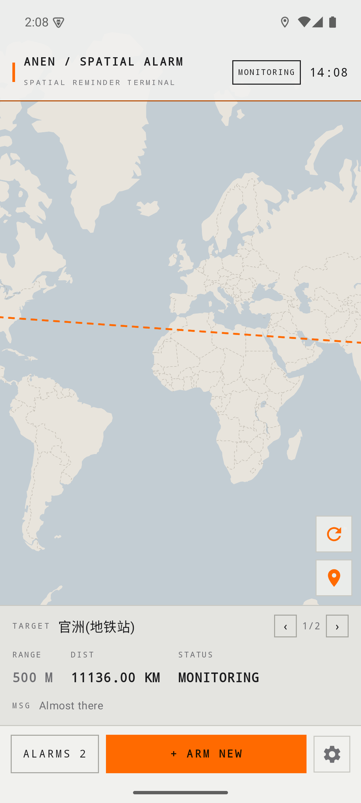
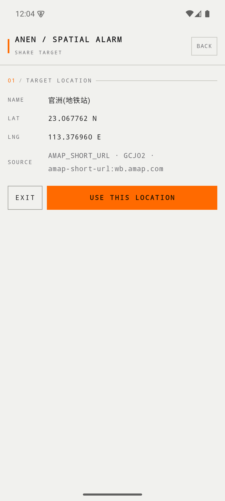
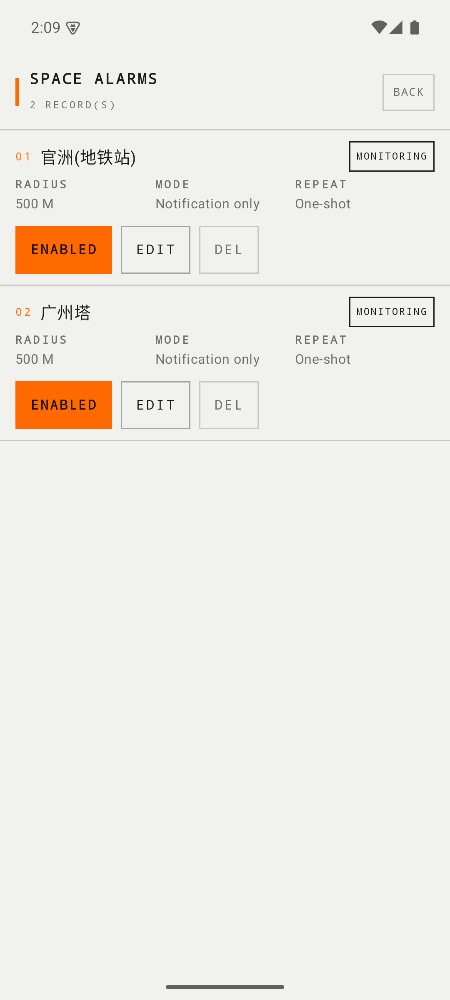
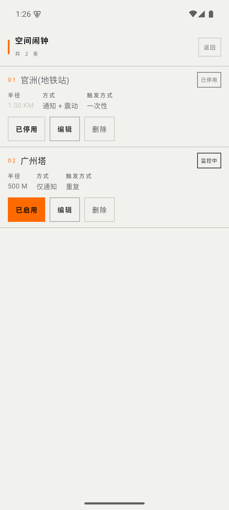

# 阿能的空间闹钟 · ANEN Space Alarm

> 一个轻量、事件驱动的 Android 空间提醒工具：**从高德地图分享地点，接近目标范围时提醒你。**

本app灵感来自于本人坐大巴又双叒叕坐过站。该应用旨在实现以下功能：

```text
我在哪里 → 目标在哪里 → 还有多远 → 什么时候提醒 → 怎么提醒
```

[English](#english) · [下载安装](#下载安装) · [截图](#截图) · [架构](#架构) · [构建](#构建) · [测试](#测试) · [许可证](#许可证)

---

## 下载安装

### 👉 [点这里直接下载 APK](https://github.com/Polarisbear8/anen-space-alarm/releases/download/v1.0.1/anen-space-alarm-1.0.1-debug.apk)（约 55 MB）

其他版本见 [Releases 页面](https://github.com/Polarisbear8/anen-space-alarm/releases)（手机浏览器里附件藏在折叠的 **Assets** 里，点开就能看到 `.apk`）。

**安装三步：**

1. 点上面的链接下载 APK，浏览器提示风险时选「**仍要下载**」
2. 打开下载好的文件安装；系统提示「**未知来源应用**」时选允许，Play 保护机制提示时选「**仍要安装**」
3. 打开 App → 按教程授予「**精确定位**」与「**始终允许**」后台定位（Android 10+ 必须，否则退到后台不会触发）→ 之后从高德地图分享地点给「阿能的空间闹钟」

> 这是 debug 签名包，仅供体验与测试。想自己编译见 [构建](#构建)。

## 特性

- **高德分享直达**：高德地图 → 分享 → 阿能的空间闹钟，自动解析地点（短链 / URI / 地点页，多级 fallback，无需任何 API Key）
- **三种提醒方式**：仅通知 · 通知 + 震动 · 通知 + 震动 + 闹铃
- **一次性 / 循环**：一次性在提醒后自动删除，循环每次进入范围都会触发
- **地图为主界面**：全部目标、触发范围圆、到目标的直线与实时距离；已启用橙色、已停用灰色
- **低功耗**：后台完全交给系统地理围栏（Geofence），**没有 GPS 轮询、没有常驻前台服务**
- **中英双语**：跟随系统，也可在设置里手动切换
- **开发者模式**（默认关闭）：分级解析日志、App 系统状态、一键复制调试报告
- **使用教程**：首次启动引导，设置里可随时重温
- 关于页的版本号似乎有点调皮，多戳几下说不定会有惊喜（别声张）

## 截图

| 地图主页 | 分享解析 | 闹钟管理 | 使用教程 |
|---|---|---|---|
|  |  |  |  |

闹钟管理中的启用/停用状态（橙色=已启用，白底=已停用，停用行要素转浅灰）：



## 架构

```text
高德 App ──分享──▶ Android Sharesheet ──▶ ShareActivity
                                              │
                                   ShareContentExtractor
                                              │
                                        AMapResolver（分级 fallback）
                                              │
                                            Place
                                              │
                                    CoordinateConverter
                                              │
                                          Reminder ──▶ Room
                                              │
                                       GeofenceEngine（接口）
                                              │
                                    Google Geofence（系统）
                                              │
                                  GeofenceBroadcastReceiver
                                              │
                                        AlertManager
                                        ┌─────┴─────┐
                                  Notification     Alarm（短时前台服务 + 全屏通知）
```

| 模块 | 说明 |
|---|---|
| `share/` | 分享入口与载荷抽取（`ACTION_SEND`、`EXTRA_TEXT` / HTML / data / ClipData 全收集） |
| `amap/` | 高德多级解析：URI → 裸坐标 → 短链 `p` 参数 → 重定向 → 静态 HTML → WebView 兜底 |
| `coordinate/` | WGS84 / GCJ02 / BD09 换算，只按声明来源转换，禁止重复转换 |
| `data/` | Room（Reminder 表、DAO、Repository），数据库不负责围栏 |
| `geofence/` | `GeofenceEngine` 抽象 + Google 实现 + 广播接收（原子抢占，防重复触发） |
| `alert/` | 通知 / 震动 / 闹铃三种表现，统一从 `AlertManager` 出口 |
| `location/` | 一次性定位 + 页面可见期间的更新流（离开页面自动取消） |
| `map/` | MapLibre Native + 自定义「ANEN Industrial」样式（道路 / 水系 / 地名 / 边界） |
| `ui/` | Compose 终端风格界面（地图主页、创建/编辑、分享确认、管理、设置、关于、教程） |
| `debug/` | 开发者模式下的系统状态与调试报告（一键复制） |

### 高德解析链

```text
L1  amapuri:// / androidamap:// / uri.amap.com 等 URI 与 URL 参数（优先，能带地点名）
L0  分享载荷里的裸坐标
L2A 高德分享短链：surl.amap.com → 跳转 → wb.amap.com → p=POI_ID,lat,lon,name
L2B 其它允许的重定向（主机白名单，逐跳校验）
L3  静态 HTML / JSON / 内嵌状态（含「地理坐标：lat,lon」）
L4  WebView 渲染后取文本（仅静态内容无坐标时启用）
```

真实分享（`https://surl.amap.com/...`）通常在 **L2A** 命中，不进入 WebView。解析失败时保留手动坐标输入作为兜底。

## 构建

要求：**JDK 17**、**Android SDK 35**（build-tools 35.0.0）。

```bash
# 1) 指向本机 SDK（也可用 ANDROID_HOME 环境变量）
echo "sdk.dir=/path/to/Android/Sdk" > local.properties

# 2) 构建 Debug APK
./gradlew assembleDebug
# 产物：app/build/outputs/apk/debug/app-debug.apk

# 3) 安装到设备
adb install -r app/build/outputs/apk/debug/app-debug.apk
```

首次在设备上使用：打开 App 会显示教程 → 按提示授予 **精确定位** 与 **“始终允许”后台定位**（Android 10+ 必须，否则退到后台不会触发）→ 从高德分享地点即可。

> `local.properties` 已被 `.gitignore` 忽略，请勿提交。

## 测试

```bash
./gradlew testDebugUnitTest          # JVM 单元测试
./gradlew connectedDebugAndroidTest  # 真机 / 模拟器集成测试
./gradlew lintDebug
```

覆盖：距离与坐标换算（含重复转换防护）、高德 URI / URL / HTML / 短链解析、并发触发抢占、权限规则、创建前范围校验、分享 Intent 全流程、WebView 兜底解析、闹钟前台服务与通知、围栏注册。

围栏触发时机、锁屏、后台、重启恢复、静音/勿扰与长时间待机功耗由系统调度决定，建议在目标机型上自行验证。

## 权限说明

| 权限 | 用途 |
|---|---|
| 精确定位 | 读取当前位置、注册地理围栏（Geofencing 要求 FINE） |
| 后台定位（始终允许） | Android 10+ 必需，否则 App 不在前台时收不到围栏事件 |
| 通知 | 显示空间提醒（Android 13+ 需要运行时授权） |
| 全屏通知 | 锁屏时显示闹钟全屏界面（Android 14+，系统仍有最终控制权） |
| 精确闹钟 | **未使用**：空间触发完全由系统地理围栏完成 |

App 不会在后台主动定位、不轮询、不常驻服务；待机时不联网、不刷新地图。

## 第三方与致谢

本项目在设计与实现中参考了以下开源项目的**思路与公开文档**（未复制其代码）：

- **MapLibre Native Android** — 地图渲染与矢量瓦片图层（本项目当前使用）
- **GeoShare** — 地图分享接收与多级链接解析思路（GPL-3.0，仅作架构参考）
- **tAlarm** — 闹钟相关实现思路
- **Brutus** — Android 闹钟实现思路
- **OpenStreetMap / OpenFreeMap** — 地理数据与开发阶段矢量瓦片

地图数据 © OpenStreetMap contributors。

> Respect open source.

## 许可证

本项目采用 [MIT License](LICENSE)。

## English

**ANEN Space Alarm** is a lightweight, event-driven Android app that alerts you when you approach a place you chose.

**[⬇ Download the APK directly](https://github.com/Polarisbear8/anen-space-alarm/releases/download/v1.0.1/anen-space-alarm-1.0.1-debug.apk)** (~55 MB, debug-signed, for testing only). Other versions are on the [Releases page](https://github.com/Polarisbear8/anen-space-alarm/releases) — on a phone browser the attachments hide behind the collapsed **Assets** section.

1. Tap the link and confirm the browser's download warning
2. Open the file; allow "install unknown apps" and, if Play Protect warns, choose "install anyway"
3. Open ANEN and grant precise + "allow all the time" background location, then share a place from AMap to ANEN

- **Share from AMap** → pick a place → Share → ANEN resolves it automatically (short links, URIs, place pages; multi-level fallback, no API key required).
- **Three alert styles**: notification only · notification + vibration · notification + vibration + alarm.
- **One-shot or repeating** alarms; repeating alarms fire on every entry.
- **Map-first UI**: all targets, geofence circles, straight-line distance; enabled targets in orange, disabled in gray.
- **Battery friendly**: background triggering relies entirely on the system geofence — no GPS polling, no always-on foreground service.
- **Bilingual** (Chinese / English), **developer mode** with per-level resolver logs and one-tap debug report export.
- The version row in About is a little mischievous — tap it a few times and see. Keep it quiet.

Build with JDK 17 + Android SDK 35: `./gradlew assembleDebug`. See [构建](#构建) for details.

Licensed under the [MIT License](LICENSE). Map data © OpenStreetMap contributors.
